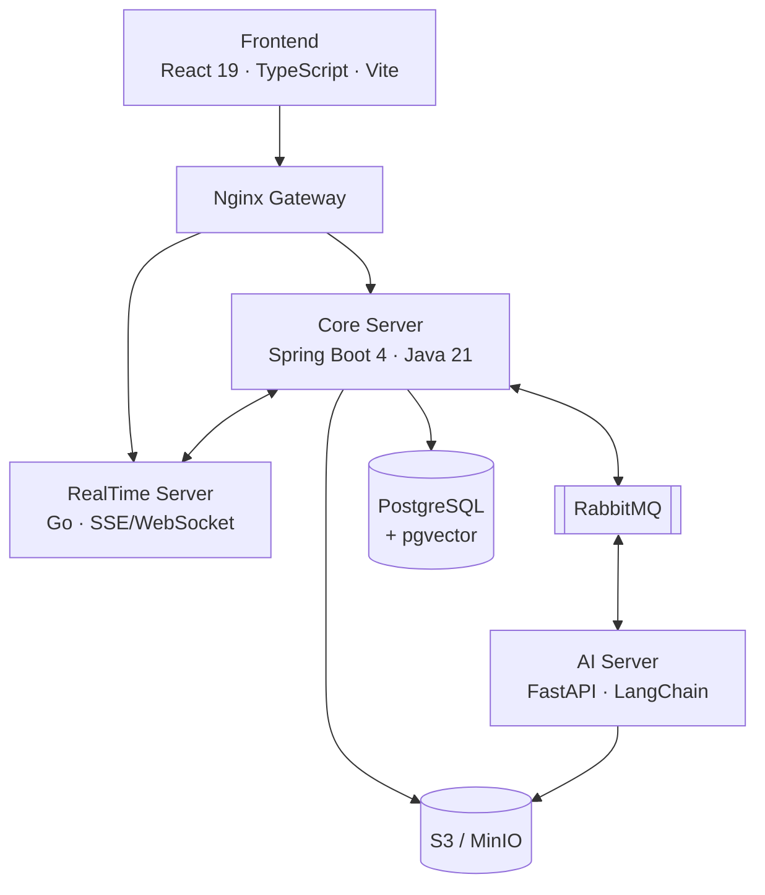

<div align="center">

# STACK-UP

**내 이력서를 아는 면접관과 연습하세요.**

GitHub 레포지토리와 이력서를 분석해 나만을 위한 질문을 만들고,
얕은 답변은 다시 파고드는 IT 직군 AI 모의면접 시뮬레이터입니다.

[stack-up.shop](https://stack-up.shop)


</div>

---

## 무엇을 하나요

일반적인 모의면접 서비스는 누구에게나 같은 질문을 던집니다. STACK-UP은 **지원자의 자료에서 질문을 만듭니다.**

1. **자료 등록** — GitHub 레포지토리, 이력서(PDF), 자기소개서를 올리면 AI가 분석해 임베딩 인덱스를 구축합니다.
2. **맞춤 면접** — 기술 · 인성 · 통합 · 직무 맞춤(회사명 + 채용공고 기반) 4가지 모드. 첫 질문은 자기소개로 시작하고, 그 답변을 씨앗으로 본 질문 풀이 만들어집니다.
3. **꼬리질문** — 답변이 얕으면 저지연 모델 + RAG로 즉시 파고듭니다. 생성되는 질문은 토큰 단위로 스트리밍됩니다.
4. **음성 면접** — 질문은 TTS로 읽어 주고, 음성 답변은 STT로 받아 적습니다. 말 속도(어절/분) · 무음 구간 · 간투어까지 측정합니다.
5. **종합 피드백** — 4축 채점(구체성 · 논리 · 구조 · 정확성), 멀티 면접관 패널 평가, 답변별 모범 답안과 리라이트, 학습 방향, 공유 링크까지.

## 시스템 아키텍처



| 컴포넌트 | 기술 | 책임 |
|---|---|---|
| [`frontend/`](./frontend) | React 19 · TypeScript · Vite · Tailwind v4 · TanStack Query | FSD 구조 SPA. 라이브 면접 UI, 피드백 리포트, 다크모드 |
| [`backend/`](./backend) | Java 21 · Spring Boot 4 · JPA · QueryDSL · Flyway | 인증(GitHub OAuth), 세션 · 메시지 · 피드백 API, **DB 단독 접근** |
| [`ai/`](./ai) | Python 3.13 · FastAPI · LangChain | 문서 분석 · 임베딩, 질문 생성, 답변 평가, 피드백 합성, STT/TTS |
| [`realtime/`](./realtime) | Go · chi · amqp091-go | 라이브 면접 WebSocket, 작업 상태 SSE, 토큰 스트리밍 중계 |
| [`infra/`](./infra) | Docker Compose | PostgreSQL(+pgvector) · RabbitMQ · MinIO |

## 설계 원칙

- **PostgreSQL 단독 접근** — DB에는 Core 서버만 접근합니다. AI · RealTime은 API 또는 RabbitMQ를 경유해 데이터 소유권을 한곳에 둡니다.
- **LLM 이중 모델 운용** — 세션 시작(질문 풀 생성)은 품질 우선 모델, 라이브 꼬리질문은 저지연 모델 + 사전 구축한 RAG 인덱스로 3초 내 응답을 노립니다.
- **비동기 메시징 + 멱등성** — AI 작업은 전부 RabbitMQ로 발행하고 콜백으로 수신합니다. DLX/DLQ, 멱등 키, 커밋 후 발행(`AFTER_COMMIT`)으로 유실과 중복을 방어합니다.
- **원자적 상태 전이** — 세션 시작 · 종료 · 중단은 조건부 UPDATE로 전이를 차지한 트랜잭션만 부수효과를 발행합니다. 동시 요청 · 스위퍼 경합에도 피드백이 중복 생성되지 않습니다.
- **분산 추적** — 모든 요청과 메시지에 `X-Trace-Id`를 전파하고, AI 요청은 비용까지 로깅합니다.
- **아키텍처 룰의 코드화** — 백엔드는 ArchUnit으로 레이어 의존 방향 · 도메인 간 순환을 빌드 단계에서 차단하고, 프론트는 FSD 의존 규칙(`app → pages → features → domain → shared`)을 따릅니다.

## 시작하기

Docker, Java 21, Node.js 20+, Python 3.13(uv), Go가 필요합니다.

```bash
# 1. 환경 변수
cp .env.example .env
cp ai/.env.example ai/.env

# 2. 인프라 (PostgreSQL, RabbitMQ, MinIO)
docker compose up -d

# 3. 서버 실행 (각각 별도 터미널)
cd backend  && ./gradlew bootRun
cd ai       && uv sync && uv run uvicorn ai_server.main:app --reload
cd realtime && go run ./cmd/realtime
cd frontend && npm install && npm run dev
```

LLM · STT API 키가 없어도 mock provider로 부팅됩니다. 전체 변수 목록은 [`docs/environment.md`](./docs/environment.md)를 참고하세요.

## 프로젝트 구조

```
stackup/
├── frontend/    # React SPA (FSD: app → pages → widgets → features → domain → shared)
├── backend/     # Spring Boot Core 서버 (도메인 우선 패키징)
├── ai/          # FastAPI AI 서버 (LangChain 체인, RabbitMQ 컨슈머)
├── realtime/    # Go 실시간 서버 (SSE · WebSocket)
├── infra/       # Docker Compose, RabbitMQ definitions
└── docs/        # 횡단 관심사 문서 (아래 표)
```

## 문서

| 주제 | 문서 |
|---|---|
| 시스템 아키텍처 · 책임 분담 | [`docs/architecture.md`](./docs/architecture.md) |
| 시나리오별 데이터 흐름 | [`docs/data-flow.md`](./docs/data-flow.md) |
| REST API 규약 · 에러 코드 | [`docs/api-conventions.md`](./docs/api-conventions.md) |
| RabbitMQ 메시지 스키마 · 재시도 | [`docs/messaging.md`](./docs/messaging.md) |
| SSE 이벤트 스펙 | [`docs/event-stream.md`](./docs/event-stream.md) |
| DB 스키마 · Flyway 정책 | [`docs/database.md`](./docs/database.md) |
| 보안 (인증 · 암호화 · 개인정보) | [`docs/security.md`](./docs/security.md) |
| 디자인 시스템 (SEED 토큰 · 다크모드) | [`docs/design-system.md`](./docs/design-system.md) |
| 브랜치 · 커밋 · PR 컨벤션 | [`docs/git-conventions.md`](./docs/git-conventions.md) |

전체 인덱스: [`docs/README.md`](./docs/README.md)

## 팀

| 이름 | 담당 |
|---|---|
| 박상우 | Backend Core — Spring Boot, OAuth, 세션 · 리포트 API, DB |
| 정준모 | AI 서빙 — LangChain/RAG, STT/TTS, 프롬프트 |
| 조서현 | RealTime 서버(Go), Core-AI 연동, GitHub 분석 |
| 신재호 | Frontend — React UI, 미디어 스트림, 웹캠 |
